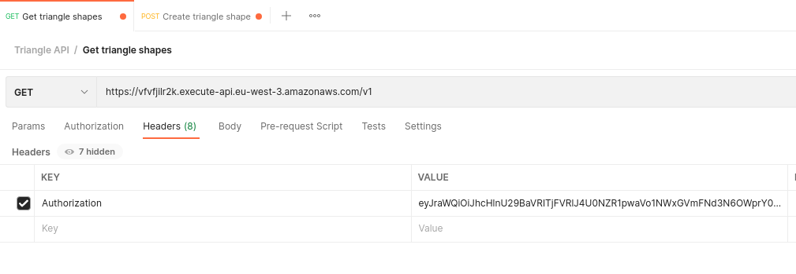

## Description
This project consists of a REST API to validate triangle types.
The types can be:

| Type       | Description                                                                                                              |
|-------------|--------------------------------------------------------------------------------------------------------------------------|
| Equilateral | All three sides are of equal length.                                                                                    |
| Isosceles   | Two sides are of equal length.                                                                                         |
| Scalene     | No sides are of equal length.                                                     |

## Credentials
1. Sign in [here](https://triangle-api.auth.eu-west-3.amazoncognito.com/login?client_id=2bflmmtop8r80gvj6e36ru2ahu&response_type=token&scope=aws.cognito.signin.user.admin+email+openid+phone+profile&redirect_uri=https://triangle-callback)
2. Confirm your email
3. Log in on the same page
4. In the resulted URL, grab the  `access_token` part 
5. Place the value of `access_token` as `Authorization` value in the `Headers` of the request
   

>`access_token` expires within 60 minutes, and it is required on all endpoints

## Usage and documentation

The project is deployed to AWS. Click [here](https://documenter.getpostman.com/view/22809238/2s8ZDeUz3r#e2800e17-50f3-4609-b41f-603039dc7340) for a description of the endpoints.

## Testing
>An activated python virtual environment is recommended
### Install dependencies

    pip install -r requirements.txt

### Run tests
    python -m unittest

